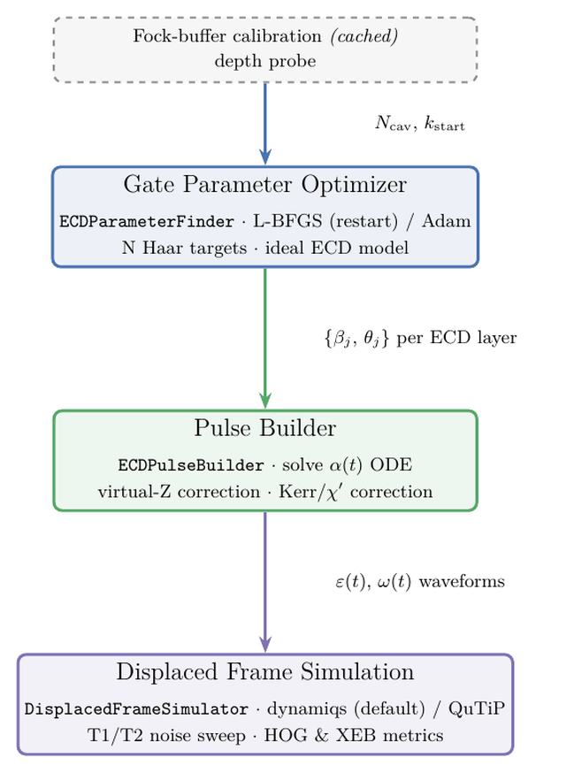

# metriq-qudits

## Installation

Requires Python 3.12 or 3.13.

1. Clone the repository:

   ```bash
   git clone https://github.com/unitaryfoundation/metriq-qudits.git
   cd metriq-qudits
   ```

2. Create and activate a virtual environment:

   ```bash
   python3 -m venv .venv
   source .venv/bin/activate          # Windows PowerShell: .venv\Scripts\Activate.ps1
   ```

3. Install the package. This pulls in the standard CPU build of JAX. GPU users
   should first follow the
   [JAX installation guide](https://docs.jax.dev/en/latest/installation.html)
   for their platform.

   ```bash
   python -m pip install --upgrade pip
   python -m pip install -e .
   ```

4. Confirm the command is installed and view the available options:

   ```bash
   metriq-qudits --help
   ```

## Running the pipeline

Run the smallest configured system without the full noise sweep:

```bash
metriq-qudits --configs d4 --skip-sweep
```

Circuit compilation and pulse-level simulation are computationally expensive.
Set `N_JOBS` to run independent circuits in parallel (`$env:N_JOBS = 8` on
Windows PowerShell):

```bash
N_JOBS=8 metriq-qudits --configs d4 --skip-sweep
```

Result figures can likewise be regenerated from cached results, either through
the `metriq-qudits` command or the standalone script:

```bash
metriq-qudits --plot-only
# or
python scripts/plot_results.py
```

`--plot-only` reads the cached results under `outputs/` and writes the figures
without rerunning compilation or simulation. (Use `--plot` instead to regenerate
the figures at the end of a normal run.)

Generated artifacts are written to a visible `outputs/` directory:

```text
outputs/
├── calibration/
├── compiled_circuits/
├── pulses/
├── noiseless/
├── noise_sweeps/
└── plots/
```

Choose a different artifact root with `--output-dir /path/to/outputs` or the
`METRIQ_QUDITS_OUTPUT_DIR` environment variable.

## Codebase overview



The command-line pipeline begins in
[`metriq_qudits/cli.py`](metriq_qudits/cli.py), which runs the following
stages:

1. **Gate parameter optimization.**
   [`compilation/compile.py`](metriq_qudits/compilation/compile.py)
   samples the target unitaries, selects the ECD circuit depth, and coordinates
   compilation. The optimizer itself is implemented in
   [`compilation/ecd_parameter_finder.py`](metriq_qudits/compilation/ecd_parameter_finder.py).

2. **Pulse construction.**
   [`pulses/pulse_stage.py`](metriq_qudits/pulses/pulse_stage.py) converts
   the compiled ECD parameters into physical control pulses using
   [`pulses/ecd_pulse_builder.py`](metriq_qudits/pulses/ecd_pulse_builder.py).

3. **Displaced-frame simulation.**
   [`simulation/sweep.py`](metriq_qudits/simulation/sweep.py) runs the
   noiseless calculation and optional T1/T2 sweep. The physical model and
   simulator are implemented in
   [`simulation/displaced_frame_simulator.py`](metriq_qudits/simulation/displaced_frame_simulator.py).

4. **Results and plots.**
   [`plot_results.py`](metriq_qudits/plot_results.py) loads the saved
   simulation results and generates the figures under `outputs/plots/`.

## References

- [Benchmarking the algorithmic reach of a high-Q cavity qudit](https://arxiv.org/abs/2408.13317)
  - The first qudit benchmarking paper from Fermilab. It implements the same
    protocol and tests as this codebase, but with the SNAP-and-displacement gate
    set rather than the ECD-and-rotation gate set used here.
- [Fast Universal Control of an Oscillator with Weak Dispersive Coupling to a Qubit](https://arxiv.org/abs/2111.06414)
  - The primary source for understanding ECD gates and the k-layer ansatz of
    alternating rotation and ECD gates used here (Fig. 1). Table S1 supplies the
    Hamiltonian parameters (χ, χ′, self-Kerr) defined in `pulses/pulse_stage.py`.
- [Crosstalk-Robust Quantum Control in Multimode Bosonic Systems](https://arxiv.org/abs/2403.00275)
  - The theory for the displaced-frame Hamiltonian (Eqs. B3–B5) and its Lindblad
    dissipators (Eq. B6), the classical trajectory α(t) (Eq. B3), and the
    spurious cavity phase corrections applied after each ECD gate (Sec. II,
    Eqs. 3 and 5). These are implemented across `simulation/`, `physics/`, and
    `pulses/ecd_pulse_builder.py`.
- [Metriq: A Collaborative Platform for Benchmarking Quantum Computers](https://arxiv.org/abs/2603.08680)
