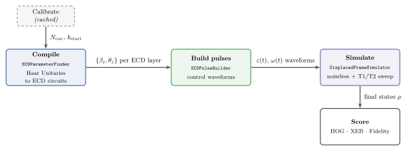

# metriq-qudits

[](https://www.python.org/)
[](LICENSE)
[](https://metriq.info/)

`metriq-qudits` is an open-source framework for benchmarking qudit systems,
developed in parallel with the qubit benchmarks implemented in
[metriq-gym](https://github.com/unitaryfoundation/metriq-gym). It complements
the benchmarking ecosystem described in the
[Metriq paper](https://arxiv.org/abs/2603.08680).

Currently `metriq-qudits` only runs (simulated) quantum volume experiements, which lives under
[`metriq_qudits/benchmarks/`](metriq_qudits/benchmarks/). More benchmarks are
planned and will be added to the benchmarks folder alongside quantum volume. 
We also plan to add hardware backend execution (see the Harware Interface page in our wiki to learn more).


## Installation

metriq-qudits requires Python 3.12 or 3.13. To get started, clone the repository and change to its directory:

```bash
git clone https://github.com/unitaryfoundation/metriq-qudits.git
cd metriq-qudits
```

From there, create and activate a virtual environment so the install stays isolated:

```bash
python3 -m venv .venv
source .venv/bin/activate          # Windows PowerShell: .venv\Scripts\Activate.ps1
```

Now install the package. This pulls in the standard CPU build of JAX, so if you are on a GPU you should first follow the [JAX installation guide](https://docs.jax.dev/en/latest/installation.html) for your platform:

```bash
python -m pip install --upgrade pip
python -m pip install -e .
```

Finally, confirm the command landed and view the available options:

```bash
metriq-qudits --help
```

## Running the pipeline

Like [metriq-gym](https://github.com/unitaryfoundation/metriq-gym), `metriq-qudits` takes JSON configuration files as input. The user provides 1) a benchmark config and 2) an optional device config, then the full pipeline runs:  compilation → pulse building → execution. Examples of both types of config files are in [`metriq_qudits/schemas/examples/`](metriq_qudits/schemas/examples/).

### Quickstart

You can use the provided experiment config files to get started. For instance, to run a quantum volume experiment using an (ideal) backend simulator, simply use a benchmark config (`--device` defaults to the noiseless ideal backend):

```bash
metriq-qudits metriq_qudits/schemas/examples/quantum_volume.example.json
```

To run the same experiment with a noise sweep, pass a device config that defines
a T1/T2 grid:

```bash
metriq-qudits metriq_qudits/schemas/examples/quantum_volume.example.json \
    --device metriq_qudits/schemas/examples/coherence_sweep.device.json
```

Once the benchmark finishes, plot the results using: 

```bash
python -m metriq_qudits.plotting.results
```

### Outputs folder
Generated artifacts are written to a visible `outputs/` directory, one subtree
per benchmark and qudit dimension:

```text
outputs/
└── runs/<benchmark>/d<d>/
    ├── calibration.npz
    ├── circuits/           # one .npz per compiled circuit
    ├── pulses/             # one .npz per pulse waveform
    └── metrics/<device>/   # scores namespaced per device
        ├── noiseless.npz
        └── sweep/          # one .npz per T1/T2 grid point
```

Each stage checks the saved results before running, so a rerun reuses saved artifacts
unless you pass `--overwrite`.


## Codebase overview

The command-line pipeline begins in
[`metriq_qudits/cli.py`](metriq_qudits/cli.py), which runs the following
stages:

1. **Gate parameter optimization.**
   Samples the target unitaries, selects the ECD circuit depth, and coordinates
   compilation. The optimizer itself is implemented in
   [`compilation/ecd_parameter_finder.py`](metriq_qudits/compilation/ecd_parameter_finder.py).

2. **Pulse construction.**
   Converts the compiled ECD parameters into physical control pulses using
   [`pulses/ecd_pulse_builder.py`](metriq_qudits/pulses/ecd_pulse_builder.py).

3. **Displaced-frame simulation.**
   Runs the noiseless simulation and optional T1/T2 sweep. The physical model and
   simulator are implemented in
   [`simulation/displaced_frame.py`](metriq_qudits/simulation/displaced_frame.py).

<br>

<p align="center">
  
</p>


#### Calibration

A one-time **calibration phase** runs before the compile stage, once per qudit
dimension. [`calibration.py`](metriq_qudits/compilation/calibration.py) sweeps
the number of Fock buffer levels above the qudit dimension and keeps the smallest
count whose calibration circuits stay stable when replayed at larger truncations.
It then probes bottom-up to pick a shallow production start depth, which yields
shorter pulses and faster simulation. The result is cached per run as
`calibration.npz` and reused automatically on later runs. Use `--overwrite` to
force a fresh calibration.

## References

- [Benchmarking the algorithmic reach of a high-Q cavity qudit](https://arxiv.org/abs/2408.13317)
  - The first qudit benchmarking paper from Fermilab. Implements the same
    protocol and tests as this codebase, but with the SNAP-and-displacement gate
    set rather than the ECD-and-rotation gate set used here.
- [Fast Universal Control of an Oscillator with Weak Dispersive Coupling to a Qubit](https://arxiv.org/abs/2111.06414)
  - The primary source for understanding ECD gates and the k-layer ansatz of
    alternating rotation and ECD gates (see Fig. 1). Table S1 serves as reference for the
    Hamiltonian parameters (χ, χ′, self-Kerr) defined in `pulses/drive_envelopes.py`.
- [Crosstalk-Robust Quantum Control in Multimode Bosonic Systems](https://arxiv.org/abs/2403.00275)
  - The theory for the displaced-frame Hamiltonian (Eqs. B3–B5) and its Lindblad
    dissipators (Eq. B6), the classical trajectory α(t) (Eq. B3), and the
    spurious cavity phase corrections applied after each ECD gate (Sec. II,
    Eqs. 3 and 5). These are implemented across `simulation/` and
    `pulses/ecd_pulse_builder.py`.
- [Metriq: A Collaborative Platform for Benchmarking Quantum Computers](https://arxiv.org/abs/2603.08680)
  - An open-source platform that integrates three components into a unified
    benchmarking workflow: [metriq-gym](https://github.com/unitaryfoundation/metriq-gym),
    a Python framework for defining and running qubit benchmarks
    across quantum hardware platforms;
    [metriq-data](https://github.com/unitaryfoundation/metriq-data), a public
    repository of benchmark results and associated metadata; and the
    [Metriq website](https://metriq.info/), which presents the collected results
    for exploration and cross-platform comparison. We plan to
    publish benchmark results from this qudit codebase on the same website,
    enabling comparisons between qubit and qudit systems.

## License

metriq-qudits is available under the [Apache License 2.0](https://github.com/unitaryfoundation/metriq-qudits/blob/main/LICENSE).
